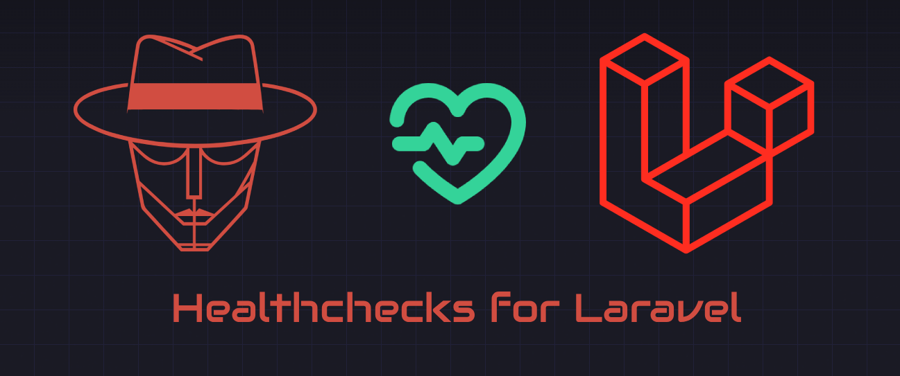

<a href="https://github.com/govigilant/vigilant" title="Vigilant">
    
</a>

# Vigilant Laravel Healthchecks

<p>
    <a href="https://github.com/govigilant/laravel-healthchecks"></a>
    <a href="https://github.com/govigilant/laravel-healthchecks"></a>
    <a href="https://github.com/govigilant/laravel-healthchecks"></a>
    <a href="https://packagist.org/packages/govigilant/laravel-healthchecks"></a>
</p>

A package that adds healthchecks to any Laravel application and integrates seamlessly with [Vigilant](https://github.com/govigilant/vigilant).

## Features

This package providers an API endpoint to check the health of your Laravel application. It returns two types of checks, health checks and metrics.
Healthchecks are checks that indicate whether a specific part of your application is functioning correctly, while metrics provide numeric values that give insights on health over time. [Vigilant](https://github.com/govigilant/vigilant) can use these metrics to notify you of spikes or quickly increasing metrics.

## Installation

Install the package via Composer:

```bash
composer require govigilant/laravel-healthchecks
```

## Configuration

Set the API token in your `.env` file:

```env
VIGILANT_HEALTHCHECK_TOKEN=your-vigilant-api-key-here
```

> **Note:** The token is required to access the health endpoint.

Optionally publish the configuration if ou want to adjust default behavior:

```bash
php artisan vendor:publish --provider="Vigilant\LaravelHealthchecks\ServiceProvider"
```

This creates `config/vigilant-healthchecks.php`.

### Scheduler

This package automatically schedules a command and a job to verify if your sheduler and queue workers are running.
If you do not want or want to customize this behavior, you can disable the automatic scheduling in the config file by setting `schedule` to `false`.

Ensure to schedule the `php artisan vigilant:scheduler-heartbeat` yourself if you disable automatic scheduling.


## Usage

### Accessing the Health Endpoint

Once installed, the health check endpoint is available with your configured bearer token at:

```
POST /api/vigilant/health
```

Or using `curl`:

```
curl -X POST "YOUR_URL_HERE/api/vigilant/health" \
  -H "Authorization: Bearer YOUR_BEARER_TOKEN" \
  -H "Content-Type: application/json"
```

### Registering Checks and Metrics

Register health checks and metrics in your `AppServiceProvider`'s `boot` method.

> **Note:** The package comes with defaults, so you may not need to register any checks or metrics manually when having the `register` setting enabled in the config file.

```php
use Vigilant\LaravelHealthchecks\Facades\HealthCheck;
use Vigilant\LaravelHealthchecks\Checks\DatabaseCheck;
use Vigilant\LaravelHealthchecks\Checks\CacheCheck;
use Vigilant\LaravelHealthchecks\Checks\RedisCheck;
use Vigilant\LaravelHealthchecks\Checks\HorizonCheck;
use Vigilant\LaravelHealthchecks\Checks\SchedulerCheck;
use Vigilant\LaravelHealthchecks\Checks\Metrics\CpuLoadMetric;
use Vigilant\LaravelHealthchecks\Checks\Metrics\MemoryUsageMetric;
use Vigilant\LaravelHealthchecks\Checks\Metrics\DiskUsageMetric;

public function boot(): void
{
    HealthCheck::registerCheck(DatabaseCheck::make());
    HealthCheck::registerCheck(CacheCheck::make());
    HealthCheck::registerCheck(RedisCheck::make());
    HealthCheck::registerCheck(HorizonCheck::make());
    HealthCheck::registerCheck(SchedulerCheck::make());

    HealthCheck::registerMetric(CpuLoadMetric::make());
    HealthCheck::registerMetric(MemoryUsageMetric::make());
    HealthCheck::registerMetric(DiskUsageMetric::make());
}
```

### Configuring Specific Connections

If you want to check non-default connections you can register healthchecks yourself in your service provider.

```php
use Vigilant\LaravelHealthchecks\Facades\HealthCheck;
use Vigilant\LaravelHealthchecks\Checks\DatabaseCheck;
use Vigilant\LaravelHealthchecks\Checks\CacheCheck;
use Vigilant\LaravelHealthchecks\Checks\RedisCheck;

public function boot(): void
{
    // Check a specific database connection
    HealthCheck::registerCheck(DatabaseCheck::make()->connection('mysql'));

    // Check a specific cache store
    HealthCheck::registerCheck(CacheCheck::make()->store('redis'));

    // Check a specific Redis connection
    HealthCheck::registerCheck(RedisCheck::make()->connection('sessions'));
}
```

### Check availability

Each healthcheck checks if it is applicable in the current environment. For example, the `HorizonCheck` will only run if Laravel Horizon is installed.
If a check is not applicable, it will be skipped and not included in the results. You may override this behaviour by registering the check manually can calling the `alwaysRun` method.

## Available Checks

| Check | Description |
|-------|-------------|
| **DatabaseCheck** | Verifies database connection and query execution |
| **CacheCheck** | Tests cache read/write operations |
| **RedisCheck** | Verifies Redis connection health |
| **RedisMemoryCheck** | Monitors Redis max memory usage |
| **QueueCheck** | Checks queue workers are processing jobs |
| **HorizonCheck** | Verifies Laravel Horizon is running |
| **SchedulerCheck** | Ensures Laravel scheduler is active |
| **StorageCheck** | Validates storage directory permissions |
| **DiskSpaceCheck** | Monitors available disk space |
| **DebugModeCheck** | Warns if debug mode is enabled in production |
| **EnvCheck** | Validates environment configuration |

## Available Metrics

| Metric | Description |
|--------|-------------|
| **CpuLoadMetric** | Current CPU load average |
| **MemoryUsageMetric** | System memory usage percentage |
| **DiskUsageMetric** | Disk space usage percentage |
| **DatabaseSizeMetric** | Total database size |
| **LogFileSizeMetric** | Laravel log file size |

## Development Environment

A ready-to-use Docker-based development environment lives in `devenv/`.
Ensure Docker is running, then start the stack: `docker compose -f devenv/docker-compose.yml up --build`.

This will create a Laravel application and link this package for development. The bearer token is set to `testing` and can be used to access the health endpoint:
```shell
curl -X POST "http://localhost:8000/api/vigilant/health" \
  -H "Authorization: Bearer testing" \
  -H "Content-Type: application/json"
```

## Quality

Run the quality checks:

```bash
composer quality
```

## Security Vulnerabilities

Please review [our security policy](../../security/policy) on how to report security vulnerabilities.

## Credits

- [Vincent Boon](https://github.com/VincentBean)
- [All Contributors](../../contributors)

## License

The MIT License (MIT). Please see [License File](LICENSE) for more information.
